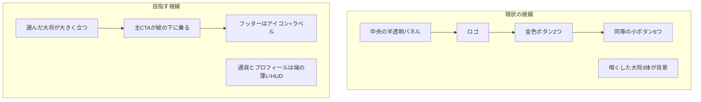

# 26. UI/UX改善提案 — Shadowverse を参考にした百鬼盤の磨き込み

このドキュメントは、現行クライアント（`client/index.html` / `client/css/style.css` / `client/src/*.ts`）の画面と操作を棚卸しし、『Shadowverse』および『Shadowverse: Worlds Beyond』（以下シャドバ）のインタラクション設計から**流用してよい原則**と、**百鬼盤としてやる改善**を整理する。見た目のコピーではなく、「なぜ魅力的に感じるか」を分解して当てはめる。

実装はまだ行わない。優先度と画面単位の提案を先に確定し、着手時は本ドキュメントを正本にする。

## 1. 結論（先に読む）

百鬼盤はすでに「夜・月・霧・金・明朝・妖怪立ち絵」という世界観の骨格を持っている。足りないのは装飾量ではなく、次の5点である。

1. **主役がUIパネルではなく立ち絵になっていない**（タイトルで大将が暗く、中央パネルが絵を覆う）
2. **画面の情報階層がフラット**（6個のメニューが同等、主要CTAの宝石感が弱い）
3. **儀式（リビール）が短い**（ガチャは全カード同時出現、図鑑登録の瞬間がない）
4. **勝ちの快感と負けのケアが非対称になっていない**（リザルトが「討伐成功 / 敗北」の文字差中心）
5. **画面切替がハードカット**（`showScreen` は `display` の付け外しのみ）

シャドバが強いのはカードゲームだからではなく、**キャラを大きく見せ、操作の学習コストを守り、演出の「嬉しさ」を意図的に配分している**からである。百鬼盤は将棋盤ゲームなのでレイアウトはコピーせず、この配分の仕方を借りる。

## 2. 参考にしたシャドバの設計思想

出典は Cygames の CEDEC 2026 講演（インタラクションデザイン）と、公開バトル画面の情報設計。用語はシャドバ側の言葉を借り、百鬼盤への翻訳を併記する。

### 2.1 継承と挑戦を言語化する

シャドバWBは「シャドバらしさ」と「新作らしさ」をキーワード分解してから絵を決めた。感覚だけで「もっと綺麗に」と言うと、案が全部正しく見えて決められない、という失敗を先に潰している。

百鬼盤でも同じ作業が必要である。

| 軸 | 百鬼盤で残す（継承） | 百鬼盤で進める（挑戦） |
|---|---|---|
| 世界観 | 夜・月・霧・墨・金、妖怪立ち絵、盤の霊気 | 装飾を細く・少なくし、イラストの抜け感を出す |
| 色 | 紫夜 + 金 + 朱/蒼の対戦色 | 金のグラデーションに強弱。全面を同じ金枠にしない |
| 文字 | 明朝（ロゴ・見出し・大将名） | 本文・ボタン説明はゴシックで可読性を優先 |
| 操作 | タップで指し、長押しで説明、編成は盤に置く | 親指が届く位置、一覧性、スキップ可能な演出 |
| 感情 | 討伐の金、敗北の冷色 | 勝ちは大きく、負けは素早くニュートラルへ |

「モダン」を要素分解すると、シャドバ側では「明るい・フラット・直線・色数が少ない」。百鬼盤の夜は暗い方が正しいので、**明るさは上げず、フラットさと線の細さだけ借りる**。青ネイビー基調への全面転換は世界観と衝突するため採らない。

### 2.2 インタラクションコストは3つ

シャドバWBは、デッキ画面の試作で「保存ボタンを右下へ」「カード枚数を2倍」にしたところ、前作ユーザーから「使いにくい」と返された。身体負荷・認知負荷を下げても、**学習コスト**が上がると総合では悪化する。

百鬼盤はリリース済みなので、次を守る。

- 指し方（短タップ移動 / 長押し説明）は変えない
- 編成の「盤に置く」メタファーは変えない
- タイトルの「百鬼夜行が主、オンラインが副」の導線は変えない
- 変えてよいのは、絵の見せ方・階層・遷移・演出尺・負けのトーン

### 2.3 ホームはキャラがメッセージ

シャドバWBのホームは、カードを円環に並べる前作から、**中央のリーダーが大きく立ち、フッターはアイコン+ラベルだけ**に変わった。ボタンの箱を消すことで絵の領域を確保し、タップでモーションとセリフが出る。ゲームの「顔」がUIではなくキャラになる。

百鬼盤のタイトルは逆で、中央のガラスパネル（`.title-center`）が主役、大将3体は `opacity: 0.5〜0.72` / `brightness: 0.68〜0.78` で背景化している。モバイルではさらに `opacity: 0.32〜0.48` まで落ちる。

### 2.4 嬉しさの数値配分

シャドバWBは演出の感情を数値化した。前作を勝利 +100 / 敗北 −100 としたとき、今作は勝利 +200 / 敗北 0 を目標にした。敗北画面から "LOSE" を外し、表情は平常のまま素早くリザルトへ。勝利はスローとズーム、相手側の崩壊まで足した。

ランク昇格 +500、グランプリ優勝 +1000 のように、**稀な達成ほど尺と粒子を増やす**。百鬼盤のリザルトは勝敗とも同じレイアウトで、タイトル文字が「討伐成功 / 敗北」と直裁している。敗北の文字が大きく、シャドバの「0（ニュートラル）」より罰が強い。

### 2.5 テンポは華やかさのまま削る

シャドバWBはターン開始〜攻撃までの同一操作を約26%短縮した。尺を残すのは進化などの「見せ場」だけで、待ち時間（余韻、操作可能になるまでのラグ）を切っている。百鬼盤もカットイン・VS・召喚は残し、**スキップと待ちの削減**を先に足す。

### 2.6 遷移に世界観のキーワードを置く

シャドバWBは「ワープ / トンネル / 境目を消す」で全画面の切替を統一した。百鬼盤なら対応する言葉は **霧が晴れる / 月が隠れる / 結界を潜る** である。現状の `showScreen` はフェードも霧もない。

### 2.7 バトルHUDの情報設計

シャドバの盤面は「上=相手リーダー、中央=場、下=自分リーダーと手札」で、防御値は肖像の横、タイマーはターン終了ボタンの周囲ゲージ、状態アイコンはタップで詳細、である。百鬼盤は5×6の将棋盤なので場の形は変えない。借りるのは次だけ。

- 大将肖像を「小さな丸アイコン」から「そのプレイヤーである」大きさへ
- 魂力は肖像のすぐ横で常時読める
- 飢餓・コンボ・覚醒は隠さず、詳細だけ二次情報にする
- 持ち駒は「チップ」ではなく、指が届くカード片にする

## 3. 現行UIの棚卸し

### 3.1 すでに強い点（壊さない）

- 色と明朝のトーンは「妖怪の夜」として一貫している
- VS開幕（斜め二分割・開戦帯）はシャドバの対峙構図に近い資産がある
- スキル/召喚カットイン、成り柱、コンボvignette、SSRガチャの金フラッシュは「見せ場」の種がある
- レアリティを色+ラベルで冗長化している（要件の色弱対応）
- タイトルの主CTAが「百鬼夜行 / オンライン」の2枚なのは正しい
- 編成が実際の2段盤であることは、カードリストに抽象化するよりルール学習に合う

### 3.2 画面ごとのギャップ



| 画面 | 現状 | シャドバから見た問題 | 百鬼盤での改善の方向 |
|---|---|---|---|
| タイトル | ガラスの中央パネル + 6カラムメニュー + 暗い立ち絵 | キャラがメッセージになっていない。フッターが箱型で絵を食う | パネルを薄く小さく。大将を前面。メニューはアイコン列 |
| 百鬼夜行ロビー | 「?」の円と連勝数字 | ステージの顔がない。次に何と戦つか想像できない | 今週の敵大将か月のアイコンを大きく。連勝は残す |
| 次戦プレビュー | ボス1枚 + 36pxの駒列 | カードゲームの「対戦準備」より情報カード | 敵編成をミニ盤で見せ、開戦へシームレス |
| バトル | 上下HUDバー + 盤 + 右のツール群 | リーダーが小さい。飢餓が「状」の裏。持ち駒26–38px | 肖像を大きく、飢餓を常時、持ち駒をカード片に |
| ガチャ | 「召」のオーブ + 結果を一括表示 | パック開封の緊張→1枚ずつの開示がない | 結界→一枚ずつ裏返し。SSRだけ尺を伸ばす。スキップ可 |
| 編成 | 木の2段盤 + 46–60pxチップ | 保存がヘッダー左上寄り。一覧性がチップでは弱い | 保存は右下。控えはカード型。合計ATKを出す |
| 駒一覧 | 横長カード、アート76px、所持差が弱い | 図鑑は「集めた絵」を大きく並べる場所 | 縦カード、未所持はシルエット、獲得時に登録演出 |
| リザルト | 大きな「敗北」文字 + 同じ構図 | 負けが −100、勝ちの差分が文字と紙吹雪程度 | 勝ちはスローと金。負けは「討ち漏らし」程度で早く戻す |
| 遷移 | `active` クラスの付け外し | 世界を渡る感覚がない | 霧/結界の共通トランジション 200–350ms |
| アイコン | 絵文字（🎟🔊🏳❔✉） | 高級感と世界観を削る | SVGの金線アイコンへ（段階的でよい） |

## 4. 百鬼盤用ビジュアル指針（実装時の判断基準）

キーワードを要素に分解する。デザインレビューではこの表で「寄せ過ぎ / 足りない」を見る。

| キーワード | やる | やらない |
|---|---|---|
| 荘厳 | 金の細線、角のL字、月のハイライト | 太い金枠を全ボタンに付ける |
| 物質感 | 1pxのハイライトと内側シャドウ、和紙/漆の差 | 木目を全画面に敷く（編成盤だけ） |
| 繊細 | 線は1px、フェードマスク、余白を増やす | グローを常時点灯（見せ場だけ） |
| 洗練 | 色数を金・紫夜・朱・蒼・紙色に閉じる | 絵文字、虹色、同じ角丸カードの量産 |
| 抜け感 | 立ち絵は枠に入れずドロップシャドウのみ | キャラを円クリップで切る（バトルHUDの現状） |
| 高級 | CTAだけ多色金グラデ。他は低彩度 | 全ボタンを `.btn-gold` にする |

フォント: ロゴ・見出し・大将名・リザルトは明朝のまま。メニューラベル・説明・数字はゴシック。英語時の `letter-spacing: 0.4em` はボタン可読性を落とすので、ラテン文字では 0.04–0.08em に戻す（既存の `html[data-script="latn"]` 方針を徹底）。

## 5. 改善策（優先度順）

優先度は「見た瞬間の商品力」と「既存操作を壊さないか」で付けた。工数のカレンダー見積はしない。

### P0 — ホームを「ゲームの顔」にする

対象: `#screen-title`, `.title-center`, `.title-bosses`, `.title-secondary-actions`

1. **選んだ大将を中央前面に出す**  
   オンボーディングで選んだ1体を大きく（画面高の55–70%）、左右の大将は消すか遠く小さくする。`opacity` / `brightness` を下げない。`.title-center` の不透明パネルはロゴ+CTAだけ残し、背景ブラーを弱めて絵を通す。
2. **メニューをフッター化**  
   6個の箱ボタンを、シャドバWB同様の「アイコン+ラベル」横列（召 / 陣 / 録 / 冠 / 指南 / 告）にする。箱のボーダーを消し、タップ領域だけ確保する。これで立ち絵の下半分が死なない。
3. **主CTAの宝石感**  
   「百鬼夜行」だけ金の多層グラデ+緩いきらめき。「オンライン」は蒼の冷たい石。両方を同じ `.btn` サイズに揃えるのは維持してよい。
4. **通貨・プロフィールは端の薄いHUD**  
   現状の配置（左プロフィール、右通貨）はシャドバと同じで正しい。絵文字チケットを金札の小アイコンに替えるのはP1でもよい。
5. **大将タップ**  
   ランダムな短いセリフ（既存の召喚タイトルやスキル名から流用可）と、軽いモーション（既にある `bossFloat` の振幅を一瞬上げる）。音声新規収録は必須にしない。

モバイル注意: 現状は狭い画面で立ち絵をさらに消している。P0の成功条件は、iPhone SE幅でも大将の顔がロゴの後ろから見えること。

### P0 — 画面遷移を「結界を潜る」に統一

対象: `client/src/util.ts` の `showScreen`

- 旧画面に霧のオーバーレイ（8–12%の白/紫、ブラー）を 180ms
- 新画面を 200ms フェードイン
- バトル開始だけ既存VSを使い、VSの最後のフラッシュを盤面へクロスフェード（今は VS が消えたあとバトルが既に出ているが、繋ぎの演出キーワードがない）
- `prefers-reduced-motion` ではフェードのみ、または即切替

タイトル↔ガチャ↔編成↔図鑑は同じトランジションにする。シャドバが「ワープ」を全コンテンツで揃えたのと同じで、**一種類を使い倒す**方が世界が繋がって見える。

### P0 — リザルトの感情配分

対象: `#screen-result`, `showResult`（`client/src/main.ts`）

| 結果 | 目標 | 具体 |
|---|---|---|
| 勝利 | +200 | 最後の一手のあと 300ms スロー（既存シェイクの延長）。タイトルは「討伐成功」のままか「勝利」。金パーティクルは現状の confetti を増やす。敵大将は倒れず、霧の向こうへ退く |
| 百鬼夜行 n連勝 | +200 + 連勝数 | 連勝数字をヒーロー数字のまま拡大。7, 10, 15 で追加の月演出 |
| 週間1位報酬 | +500相当 | 既存の異装獲得と接続。専用の登録演出 |
| 敗北 | 0 | **「敗北」の巨大文字を使わない**。案: 「討ち漏らし」「夜が明けた」。敵大将は勝ち誇らず、自軍大将は平常。紙吹雪なし。1.2秒以内にボタン操作可 |
| 投了・切れ負け | 0 | さらに短い。理由文だけ |

シャドバが "LOSE" を外した理由は、負けの事実を演出で増幅しないため。百鬼盤の「敗北」は明朝で大きく、増幅している。

### P1 — バトルHUDを「大将対大将」にする

対象: `#screen-battle` の `.hud`, `.hand-chip`, `#btn-battle-status`

レイアウト原則（盤の5×6は維持）:

```
[敵大将肖像 大きめ] 名前 / 魂力バー / 覚醒ピップ
[持ち駒は小さく・説明用]
           5×6 盤
[自持ち駒 カード片・タップで打ち]
[自大将肖像] 名前 / 魂力 / 覚醒ボタン
飢餓: 常時「あとn手」を盤の脇または魂力バー下に出す
```

1. 肖像の円クリップをやめ、バストアップを枠なしで置く（シャドバの「枠に入れずに大きく」）。対戦色は肖像下の細いラインだけで示す。
2. 飢餓は `#btn-battle-status` の裏に閉じ込めない。8手は対局の心臓なので、常時カウンター。月齢だけパネルでよい。
3. 持ち駒は最小 44px。選択中は上にせり出し、シャドバの手札持ち上げに相当させる。
4. オンラインの持ち時間は右下のパネルのままでよいが、自ターン中は魂力バーか盤枠が脈打つなど、視線がタイマーパネルへ飛ばなくて済むようにする。
5. 覚醒はシャドバの超進化ほど盤面を壊さない。ただし発動時は対象駒を1.15倍まで拡大し、カットイン後すぐ操作可能にする（待ちを切る）。

学習コスト: 指し方と長押し説明は維持。HUDの見た目だけ変える。

### P1 — ガチャを「開封儀式」にする

対象: `#screen-gacha`, `MenuUI.doPull` / `showResults`

現状は召喚オーブ → 1.1–1.45秒 → 全カードが 0.13s ずれで同時展開。SSRの画面フラッシュはあるが、**どの1枚がSSRかを開ける前に待たせる緊張**がない。

提案フロー:

1. 結界（既存オーブで可）  
2. 裏向きの札が count 枚並ぶ  
3. タップまたは自動で1枚ずつ表。N/Rは速い。SRで少し止まる。SSR/異装はフルカットイン  
4. 10連の最後に一覧  
5. NEW は「図鑑に記された」短い演出（P1の図鑑とセット）  
6. **スキップ**（画面タップで即一覧）。常連の身体負荷を下げる。シャドバが演出を26%削ったのと同じ理由  
7. 排出率は現状どおり常時掲示。見た目だけ「札の裏」に移してもよいが、法務上の常時確認は維持する

オーブの「召」文字は世界観に合うので残してよい。シャドバのパックに寄せて箱にする必要はない。

### P1 — 図鑑と編成を「コレクションの快感」にする

**駒一覧**

- グリッドを縦カード（アートを上半分）にする。モバイル1列の横長カードは「資料」に見えて「収集物」に見えない
- 未所持はシルエット+レアリティ。所持はフルカラー。シャドバ図鑑のニヤニヤはここ
- 獲得直後に該当カードへスクロール＋金枠（図鑑登録）
- フィルタはレアリティに加え、大将 / 所持 / 未所持。検索は維持

**編成**

- 2段盤は維持（ルールの学習コスト）
- `#btn-form-save` を右下の固定CTAへ。親指と、シャドバが一度失敗して戻した「習慣の位置」の両方に効く。初見ユーザーが多い百鬼盤では右下が正しい
- 控えはチップから小型カードへ。名前またはATKを1行
- 編成合計ATKと大将名を盤の上に常時。保存失敗メッセージは既存 `#form-error` でよい

### P2 — 見せ場の差分をシステムに連動させる

シャドバの超進化は「無敵化・吹き飛ばし」というルール変化に巨大化演出をくっつけた。演出だけ豪華にしても通常進化と差がつかない、という教訓。

百鬼盤で同じことをするなら:

| システム | 演出の差分 |
|---|---|
| 通常の駒取り | 既存バースト |
| コンボ2以上 | 既存vignette + 数字の拡大（現状でもあり） |
| 成り | 既存の光の柱。尺は維持、操作可能までの待ちだけ削る |
| SSR召喚 | 既存カットイン |
| 覚醒 | 対象駒の巨大化（1.15–1.25）+ 盤震動。通常カットインより「盤が変わる」こと |
| 大将討取 | VSの逆再生、または月が欠ける。リザルトへ直結 |

新規3Dや専用動画はスコープ外。既存 `FX`（canvasパーティクル）のパラメータ差で足りる。

### P2 — その他の磨き

- ログインボーナスを7マスの月齢カレンダーに（連続の視覚化）
- オンライン待機を「霧の中で相手を待つ」ループにし、過疎時は百鬼夜行へ誘導（ロードマップ項目2と接続）
- 絵文字アイコンのSVG化
- Steam版は同じUI。広告ボタンはWebのみ（既存方針）
- 将来のレーティングが来たら、シャドバのランクマッチボタンのようにタイトルCTAへ徽章を乗せる。今は作らない

## 6. やらないこと

- シャドバの青基調・カード枠・パーク・ショップUIの模倣
- 有償パック開封演出の強化を収益化に繋げること（有償ガチャは非スコープ）
- 指し方の変更、長押し説明の廃止
- 全画面の3D化、新規BGM必須化
- 既存ユーザーの編成・ガチャ導線の位置を週単位で入れ替えること

## 7. 検証

実装に入ったら次で判断する。新規KPIは作らず、既存の対局完走率・ガチャ参加率・D1に加えて定性を見る。

- タイトル: モバイル実機で大将の顔がロゴと重なっても識別できるか
- 遷移: タイトル→ガチャ→編成→タイトルが1つの「霧」で繋がって感じるか
- ガチャ: スキップなし10連が苦痛でないか、スキップ後に結果が読めるか
- リザルト: 連敗したとき「敗北」の巨大文字よりストレスが低いか
- バトル: 飢餓まであとn手が、教えられなくても見つけられるか
- アクセシビリティ: レアリティが色だけにならないこと（現状維持）、`prefers-reduced-motion`
- 既存e2e（`test/e2e`）のセレクタ（`btn-start`, `btn-gacha` 等）を壊さないこと

## 8. 推奨する実装順

1. タイトルの階層と立ち絵（P0）— ストア映像と初回印象がここで決まる  
2. `showScreen` の結界遷移（P0）— 以降の画面改修に乗せる  
3. リザルトの勝ち/負けトーン（P0）  
4. ガチャの1枚ずつ + スキップ（P1）  
5. バトルHUDと飢餓の常時化（P1）  
6. 図鑑カード化と編成の保存位置（P1）  
7. 覚醒の盤面差分などP2  

1を入れた時点で「シャドバを参考にした」ことの大半は達成できる。装飾の追加より、**絵を見せ、負けを殴らず、切替を霧にする**方が商品としての魅力に効く。
